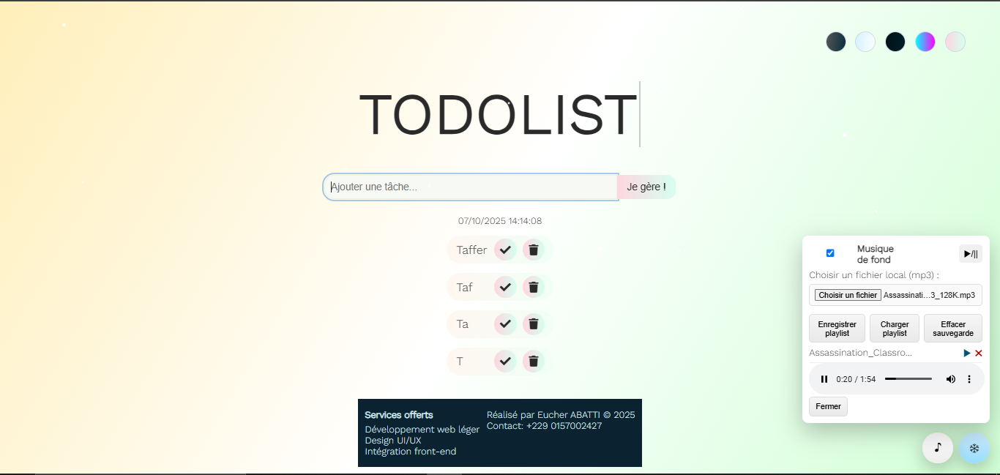
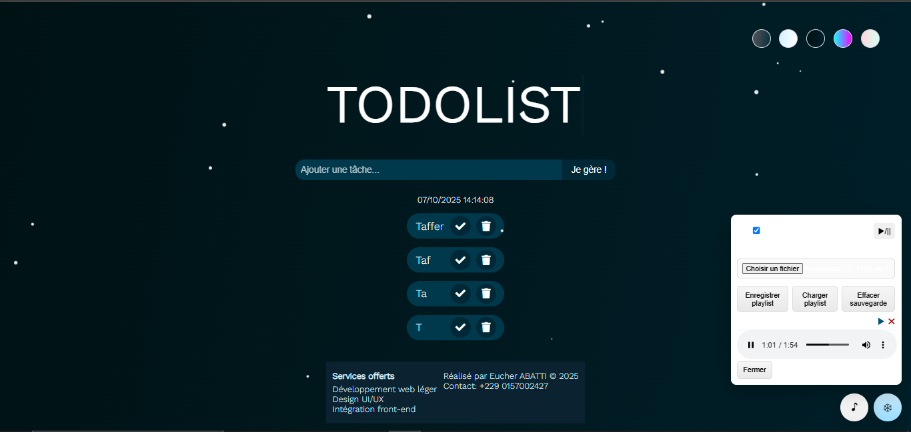
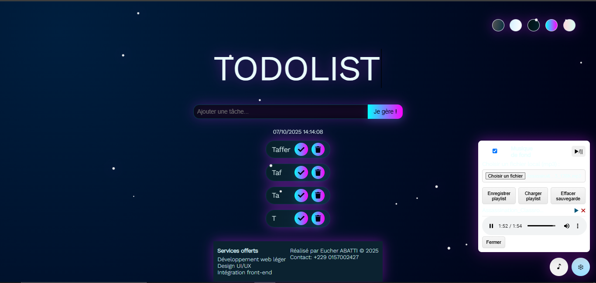

# ToDoList - Projet (FR)

Une petite application To-Do list statique, enrichie de thèmes, d'animations festives (neige + sapins) et d'un mini-lecteur audio.

Contenu du dépôt
- `index.html` — page principale (interface utilisateur)
- `CSS/` — styles (principal et corner)
- `JS/` — scripts : `main.js` (logique ToDo + thèmes), `time.js`, `festive.js` (neige), `music.js` (lecteur)
- `assets/` — images et éventuellement fichiers audio

Exemples d'aperçus visuels :

  
Légende : Écran principal avec thème clair et lecteur audio.

  
Légende : Liste de tâches et pastilles de thème.

  
Légende : Panneau musique ouvert et contrôles.

Fonctionnalités
- Ajout / suppression de tâches, persistance simple via localStorage.
- Thèmes : standard, clair, sombre, néon, pastel (sélecteurs desktop + menu mobile).
- Animations : texte animé, hover des todos, effets à la suppression, glow néon.
- Mode festif : neige animée via canvas et sapins CSS en bas de page; bouton flottant pour activer/désactiver la neige.
- Mini-lecteur audio : ajouter pistes via URL ou fichier local, lire via HTML5 audio, sauvegarder/charger playlist en localStorage.
- Menu hamburger responsive pour mobile.

Accessibilité et mobile
- Le document est en français (`<html lang="fr">`).
- Focus visible (outline) sur éléments interactifs pour claviers.
- Cibles tactiles agrandies (boutons flottants, contrôles) pour mobile.
- Menu mobile accessible avec `aria-expanded`/`aria-hidden`.

Instructions rapides
1. Ouvrir `index.html` dans un navigateur moderne.
2. Ajouter une tâche via le champ et le bouton "Je gère !".
3. Changer le thème via les pastilles (desktop) ou le menu hamburger (mobile).
4. Cliquer sur ❄ pour activer/désactiver la neige.
5. Ouvrir ♪ pour le lecteur : téléverser un ou plusieurs fichiers locaux (mp3) via "Choisir un fichier" puis cliquer ▶ pour jouer un morceau individuel.
6. Nouvelle option : "Lecture aléatoire" — sélectionnez plusieurs fichiers et cliquez sur "Lecture aléatoire" pour lire la playlist dans un ordre aléatoire (une seule passe). Utilisez "Enregistrer playlist" pour sauvegarder les URLs persistantes (les fichiers locaux (objectURL) ne sont pas persistés entre sessions).
7. Utiliser "Enregistrer playlist" pour sauvegarder les URLs (localStorage). Les fichiers locaux ne sont pas persistés (objectURL session-only).

Notes techniques
- `JS/festive.js` : dessine les flocons via canvas et réduit la densité sur petits écrans pour économiser la CPU.
- `JS/music.js` : gère la playlist, le téléversement local (objectURL), la sauvegarde et le chargement depuis `localStorage`.
- Les images et fichiers audio peuvent être placés dans `assets/` et ajoutés via URL relative (ex. `assets/morceau.mp3`) pour être facilement persistés.

Personnalisation
- Modifier les couleurs/thèmes dans `CSS/main.css`.
- Changer les animations dans `CSS/main.css` (keyframes) ou la logique de flocons dans `JS/festive.js`.

Crédit
Réalisé par Eucher ABATTI © 2025
Contact: +229 0157002427

Licence
Ce projet est fourni tel quel. Adaptez, réutilisez et partagez selon vos besoins.

Cette application To-Do list est un prototype statique.

Changements récents:

- Correction d'une balise non fermée autour du coin supérieur gauche.
- Remplacement du coin SVG par une image utilisateur (`assets/photo1.png`) et ajout d'une animation au survol.
- Ajout de nouveaux thèmes : `neon` (flashy) et `pastel` (doux). Les thèmes sont sélectionnables via les petits ronds en haut à droite.
- Traduction de l'interface en français (placeholders et boutons) et messages d'alerte en français.
- Ajout d'animations "de ouf" : effets glow, flottement des items, transition lors de la suppression.

Comment tester:

1. Ouvrez `index.html` dans un navigateur.
2. Cliquez sur les pastilles de thème pour basculer entre les thèmes (standard, clair, sombre, néon, pastel).
3. Survolez l'image dans le coin supérieur gauche pour voir l'animation.

Si vous souhaitez d'autres animations, variations de couleurs ou revenir au SVG GitHub, dites-le et je l'adapterai.

